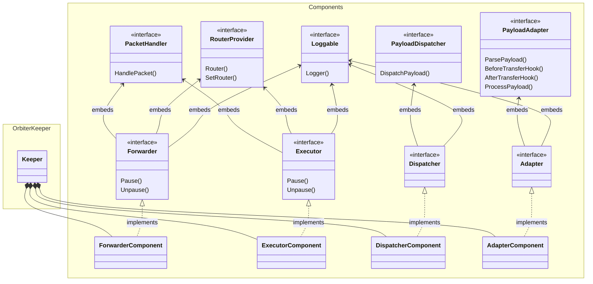

# Orbiter Architecture

This document provides a detailed overview of the `x/orbiter` module architecture and logic.

## Data Flow

1. **Entrypoint**: An external protocol sends a cross-chain transfer with attached metadata to the
   Orbiter exposed entrypoints.
2. **Payload Parsing**: The entrypoint, which wires the adapter, extracts the payload. Adapter
   validates and parses protocol-specific payload format.
3. **Hooks Execution**: The adapter clears previous balances and validates incoming funds to create
   the expected initial condition for the state transition. Based on the incoming protocol used,
   specific hook can be used.
4. **Payload Processing**: Adapter forwards validated payload to Dispatcher.
5. **Payload Dispatching**: The dispatcher coordinates the dispatch of the orbiter payload content.
6. **Action Handling**: The dispatcher dispatches pre-actions sequentially. For every action, a
   specific action controller is required to execute the business logic.
7. **Orbit Handling**: The dispatcher dispatches the cross-chain forwarding operation. Similarly to
   the action processing, every protocol makes use of a specific controller.
8. **Statistics Update**: The dispatcher records metrics for monitoring.

## Class Diagram

The following diagram provides a high-level overview of the interfaces and concrete structures
defined in the module. From the diagram, it is possible to define 4 main groups:

- The main keeper.
- Keeper's components.
- Routers for the controllers.
- Controllers.

## Keeper

The Orbiter design follows a components-based approach. As with any standard Cosmos SDK module,
there is a central keeper that controls access to the underlying module state, both for read and
write operations. The keeper manages the state and business logic by splitting responsibilities
across components. Each component is responsible for a single functionality, and all together they
allow forwarding cross-chain funds with pre-transfer custom state transitions.

## Components

Components are used to allow the Orbiter keeper to perform the three fundamental operations:

1. Adapt the bridge protocol by creating a unique internal request type.
2. Execute actions on the Noble core with the received funds.
3. Forward the funds resulting from the internal actions to the destination.

### Adapter Component

The `AdapterComponent` (`keeper/components/adapter.go`) serves as the interface between external
cross-chain communication protocols and the internal handling of the orbiter packets. The role of
this component is to create the expected orbiter payload out of the cross-chain metadata received.

This component does not directly adapt the incoming metadata, but keeps track internally of the
available adapter controllers and routes the incoming metadata to the correct one.

**Key Responsibilities**:

- **Payload Parsing**: Validates and parses incoming cross-chain payloads. This phase is required to
  convert cross-chain metadata formatted into different standards based on the bridge, into an
  internal payload type.
- **Adapter Controllers Routing**: Routes to the correct adapter the incoming data.
- **Transfer Hooks**: Executes pre/post transfer logic. In this phase, the adapter creates and
  verifies the initial conditions to execute an Orbiter state transition.
- **Protocol Routing**: Routes operations defined in the payload to the proper forwarding (orbit) or
  action handler. // TODO

### Dispatcher Component

The `DispatcherComponent` (`keeper/components/dispatcher.go`) orchestrates payload execution by
coordinating actions and forwarding operations. This component is created by injecting the executor
and forwarder component.

**Key Responsibilities**:

- **Payload Validation**: Ensures payload structure and content validity
- **Action Dispatching**: Dispatches pre-actions sequentially (fees, swaps, etc.) to the proper
  handler.
- **Forwarding Execution**: Dispatches cross-chain forwarding operations to the proper handler.
- **Statistics Tracking**: Maintains dispatch counts and amount metrics.

### Executor Component

The `ExecutorComponent` (`keeper/components/executor.go`) handles action operations by performing
state transitions on the Noble chain.

This component does not execute any actions, but keeps track internally of the available action
controllers and routes the incoming request to the correct one.

**Key Responsibilities**:

- **Packet Handling**: Handles an incoming action packet.
- **Action Packet Validation**: Validates if an action packet is valid and can be executed.
- **Action Controllers Routing**: Stores and routes the incoming action request to the proper
  controller.

### Forwarder Component

The `ForwarderComponent` (`keeper/components/forwarder.go`) handles the outgoing cross-chain
transfer by forwarding the orbiter balance to the destination. This module operates on the resulting
denom and amount of all the actions executions.

This component does not execute any cross-chain transfers, but keeps track internally of the
available forwarding controllers and routes the incoming request to the correct one.

**Key Responsibilities**:

- **Packet Handling**: Handles an incoming forwarding packet.
- **Forwarding Packet Validation**: Validates if a forwarding packet is valid and can be executed.
- **Forwarding Controllers Routing**: Stores and routes the incoming forwarding request to the
  proper controller.

## Controllers

To provide loose coupling between the actions and the supported bridges within the orbiter keeper, a
controller pattern has been implemented. Using controllers, the specific logic associated with an
action or a bridge protocol is not implemented directly into the associated component. The specific
logic is implemented through controllers that are injected into the components during app
initialization. This way, components are responsible for executing only high-level logic that is
independent of specific requests, and for routing the low-level execution to the associated
controller.

## Router

The router is a custom type that facilitates the in-memory storage of all orbiter controllers and
their invocation. Components that require the coordination of controllers embed the generic router
type and expose methods to set controllers. When a specific controller is needed, it is requested
from the router and then its public methods can be called.

