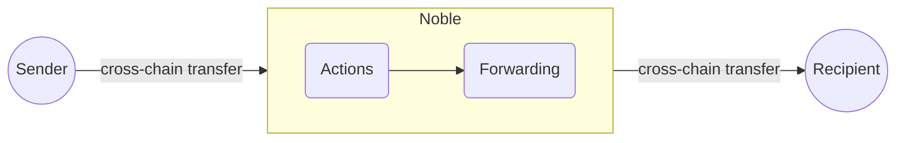

# `orbiter`

[](https://github.com/noble-assets/orbiter/releases/latest)
[](https://github.com/noble-assets/orbiter/blob/main/LICENSE)
[](https://github.com/noble-assets/orbiter/actions/workflows/unit-tests.yaml)
[](https://github.com/noble-assets/orbiter/actions/workflows/e2e-tests.yaml)


Orbiter is a cross-chain routing infrastructure built with the Cosmos SDK to enable seamless
cross-chain composability between different chains connected with Noble.

## Description

The orbiter module provides an abstraction layer on top of multiple bridging solutions to guarantee
users a frictionless interface to transfer coins between multiple chains. Thanks to its
instant-finality and real-world asset issuance capabilities, Noble can be used as a permissionless
router to transfer funds from any chain connected with Noble to any other chain, via the orbiter.

Cross-chain composability is achieved on top of any general message passing protocol via transfer of
funds enshrined with metadata.

The composability flow is defined by the 3-steps logic:

1. Funds with a payload are transferred to Noble.
2. Actions like swaps or fee payments, if specified, are handled on Noble.
3. Funds are routed to another chain based on information provided in the payload.



An example application is a user who has _USDC_ on Solana and wants to have _USDN_ on Hyperliquid.
The orbiter module allows the user to send _USDC_ to Noble Core via CCTP, swap _USDC_ for _USDN_
through the [Swap module](https://github.com/noble-assets/swap), and finally send the received funds
to Hyperlane. Everything, within a single transaction.

## Definitions

Payload components:

- **Action**: Represents a generic state transition logic that can be executed on the Noble chain
  through information contained in a cross-chain payload.
- **Forwarding**: Defines the information required to execute a cross-chain transfer from Noble to a
  destination chain through a specific bridging protocol.

Identifiers:

- **Action ID**: the identifier for an action.
- **Protocol ID**: the identifier for a bridge protocol.
- **Counterparty ID**: the identifier of a chain for a specific bridge protocol.
- **Cross-chain ID**: the unique identifier of the tuple (protocol ID, counterparty ID).

## Supported Protocols & Actions

The Orbiter module supports a subset of the bridge protocols available in Noble Core. Protocol
support varies depending on whether they handle incoming or outgoing transfers. The list of
protocols and actions will be updated when new bridges and Noble actions will be supported.

### Bridge Protocols

| Protocol  | Incoming | Outgoing | Description                             |
| --------- | -------- | -------- | --------------------------------------- |
| IBC       | ✅       | ❌       | Inter-Blockchain Communication Protocol |
| CCTP      | ❌       | ✅       | Circle Cross-Chain Transfer Protocol    |
| Hyperlane | ❌       | ❌       | Hyperlane Protocol                      |

### Actions

| Action | Status | Description         |
| ------ | ------ | ------------------- |
| Fee    | ✅     | Fee deduction       |
| Swap   | ❌     | Incoming token swap |

## Installation

```sh
git clone https://github.com/noble-assets/orbiter.git
cd orbiter
git checkout <TAG>
make build
```

## Tests

Tests for the module can be executed via the `Makefile`. To run unit tests:

```sh
make test-unit
```

End-to-end tests are based on
[interchaintest](https://github.com/strangelove-ventures/interchaintest) to verify full system
functionality. They require Docker running and a local image of the simulation application:

```sh
make local-image
make test-e2e
```

If you want to run a specific test case:

```sh
go test -v ./e2e/... -run <TEST_NAME>
```

## Architecture

See [`architecture.md`](./docs/architecture.md).

## Integration

See [`integration.md`](./docs/integration.md)
