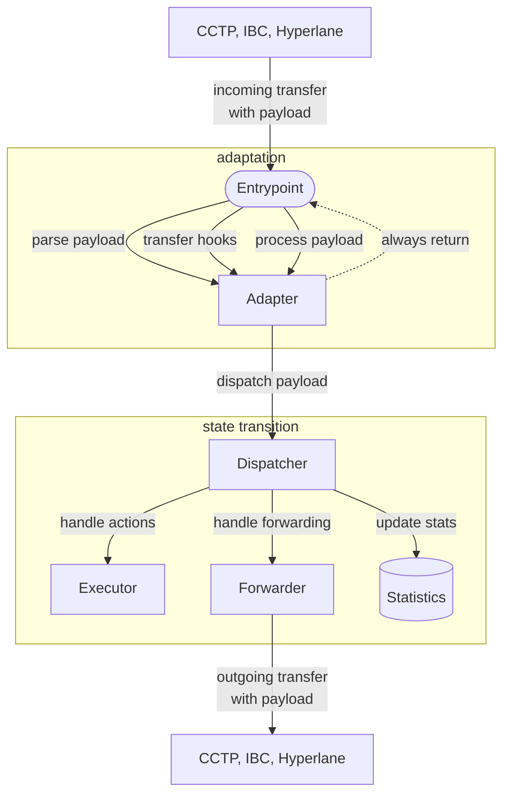
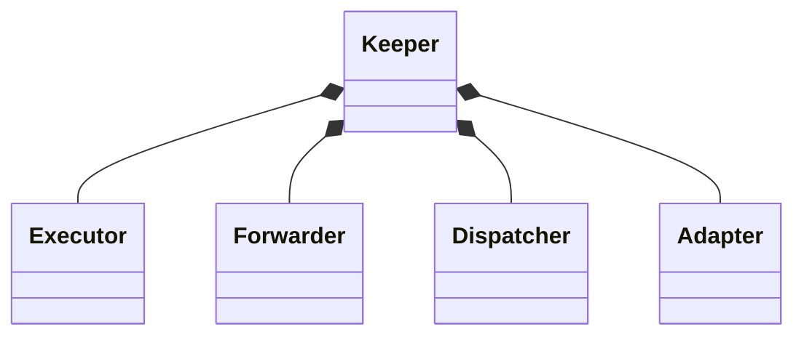
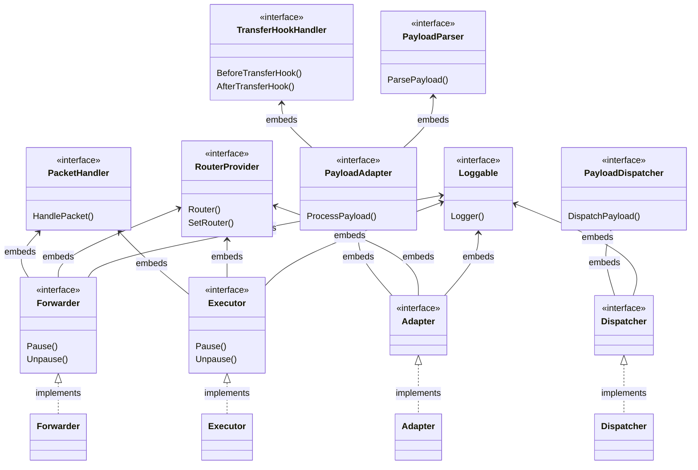
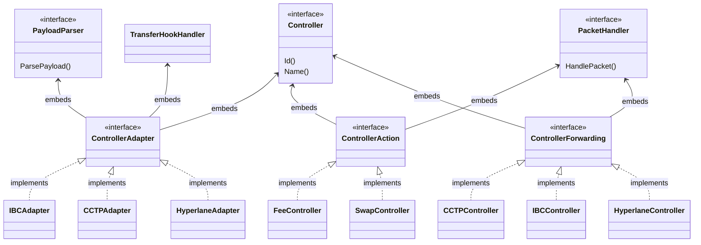
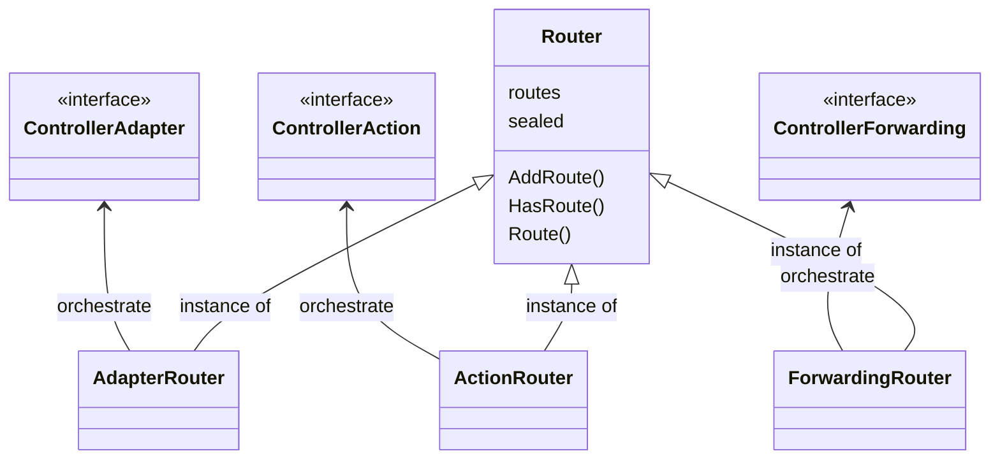

# Architecture

This document provides a detailed overview of the `x/orbiter` module architecture and logic.

## Data Flow

1. **Entrypoint**: An external protocol sends a cross-chain transfer with attached metadata to the
   Orbiter exposed entrypoints. An entrypoint can be an IBC middleware, a hook, or a gRPC endpoint.
2. **Payload Parsing**: The entrypoint extracts the payload using the **adapter component**. The
   adapter components uses protocol specific **adapter controllers** to unmarshal/decode the
   payload.
3. **Hooks Execution**: The adapter component clears previous balances and validates incoming funds
   to create the expected initial condition for the state transition. Based on the incoming protocol
   , specific hooks can be used.
4. **Payload Dispatching**: The **dispatcher component** coordinates the dispatch of the orbiter
   payload content to the **executor component** and the **forwarder component**.
5. **Action Handling**: Before passing the sent funds to the forwarding mechanism, socalled pre-actions are dispatched sequentially to the executor. For
   every action, a specific **action controller** is required to execute the business logic.
6. **Orbit Handling**: Next, the cross-chain forwarding is dispatched. Similar to the action
   processing, every protocol is handled by a specific **forwarding controller**.
7. **Statistics Update**: The dispatcher records metrics for monitoring.

## Class Diagram

The orbiter module is composed by four core elements:

- The main `Keeper`.
- The keeper's `Components`.
- Specific `Controllers` for actions and protocols.
- `Routers` for the controllers.

The following sections contains a detailed overview of the core elements and their relations.

### Keeper

The Orbiter design follows a components-based approach. As with any standard Cosmos SDK module,
there is a central keeper that controls access to the underlying module state, both for read and
write operations. The keeper manages the state and business logic by splitting responsibilities
across components. Each component is responsible for a single functionality, and all together they
allow forwarding cross-chain funds with pre-transfer custom state transitions.

### Components

Components are used to allow the Orbiter keeper to perform the three fundamental operations:

1. Adapt to the incoming bridge protocol by creating a unique internal request type.
2. Execute actions on the Noble core with the received funds.
3. Forward the funds resulting from the internal actions to the destination.

#### Adapter

The `Adapter` (`keeper/components/adapter.go`) serves as the interface between external cross-chain
communication protocols and the internal handling of the orbiter packets. The role of this component
is to create the expected orbiter payload from the received cross-chain metadata.

This component does not directly adapt the incoming metadata, but keeps track internally of the
available adapter controllers and routes the incoming metadata to the correct one.

**Key Responsibilities**:

- **Payload Parsing**: Validates and parses incoming cross-chain payloads. This phase is required to
  convert cross-chain metadata formatted into different standards based on the bridge, into an
  internal payload type.
- **Adapter Controllers Routing**: Routes the incoming data to the correct adapter.
- **Transfer Hooks**: Executes pre/post transfer logic. In this phase, the adapter creates and
  verifies the initial conditions to execute an Orbiter state transition.
- **Protocol Routing**: Routes operations defined in the payload to the proper forwarding or action
  handler.

#### Dispatcher

The `Dispatcher` (`keeper/components/dispatcher.go`) orchestrates payload execution by coordinating
actions and forwarding operations. This component is created by injecting the executor and forwarder
component.

**Key Responsibilities**:

- **Payload Validation**: Ensures payload structure and content validity
- **Action Dispatching**: Dispatches pre-actions sequentially (fees, swaps, etc.) to the proper
  handler.
- **Forwarding Execution**: Dispatches the single cross-chain forwarding operation.
- **Statistics Tracking**: Maintains dispatch counts and amount metrics.

#### Executor

The `Executor` (`keeper/components/executor.go`) handles action operations by performing state
transitions on the Noble chain. This component does not execute any action directly, but keeps track
internally of the available action controllers and routes the incoming request to the correct one.

**Key Responsibilities**:

- **Packet Handling**: Handles an incoming action packet.
- **Action Packet Validation**: Validates if an action packet is valid and can be executed.
- **Action Controllers Routing**: Stores and routes the incoming action request to the proper
  controller.

#### Forwarder

The `Forwarder` (`keeper/components/forwarder.go`) handles the outgoing cross-chain transfer by
forwarding the orbiter balance to the destination. This module operates on the resulting denom and
amount of all the actions executions. This component does not execute any cross-chain transfer
directly, but keeps track internally of the available forwarding controllers and routes the incoming
request to the correct one.

**Key Responsibilities**:

- **Packet Handling**: Handles an incoming forwarding packet.
- **Forwarding Packet Validation**: Validates if a forwarding packet is valid and can be executed.
- **Forwarding Controllers Routing**: Stores and routes the incoming forwarding request to the
  proper controller.

### Controllers

To provide loose coupling between the actions and the supported bridges within the Orbiter's keeper,
a controller pattern has been implemented. Using controllers, the specific logic associated with an
action or a bridge protocol is not implemented directly into the associated component. The specific
logic is implemented through controllers that are injected into the components during app
initialization. This way, components are responsible for executing only high-level logic that is
independent of specific requests, and for routing the low-level execution to the associated
controller.

### Router

The router is a custom type that facilitates the in-memory storage of all orbiter controllers and
their invocation. Components that require the coordination of controllers embed the generic router
type and expose methods to set controllers. When a specific controller is needed, it is requested
from the router and then its public methods can be called.

