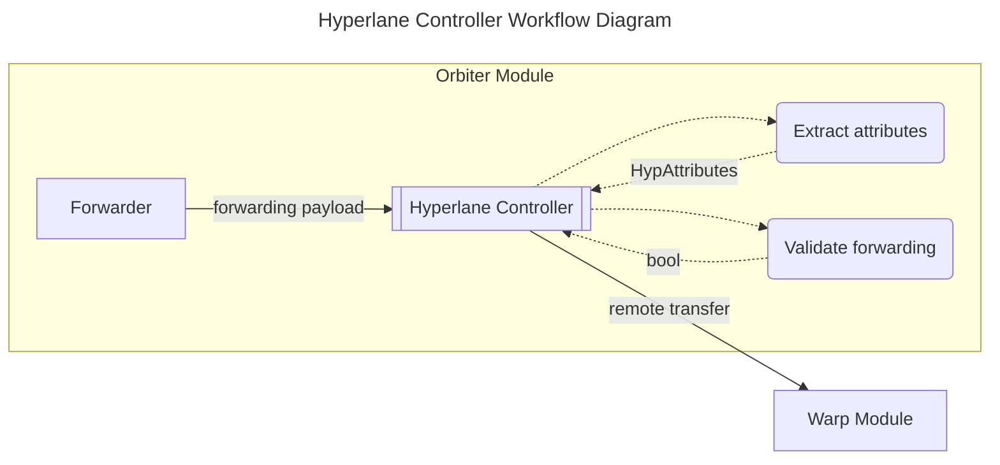

# Controllers

## Introduction

Forwarding controllers are the software components implementing the
[`ForwardingController`](https://github.com/noble-assets/orbiter/blob/main/types/controller.go#L30-L33)
interface responsible for handling forwarding packets.

```go
type ControllerForwarding interface {
 Controller[core.ProtocolID]
 PacketHandler[*ForwardingPacket]
}
```

A [`ForwardingPacket`](https://github.com/noble-assets/orbiter/blob/main/types/packet.go#L171-L174)
is composed by two parts:

```go
type ForwardingPacket struct {
 TransferAttributes *TransferAttributes
 Forwarding         *core.Forwarding
}
```

- **Transfer attributes**: General information associated with the cross-chain transfer.
- **Forwarding attributes**: Specific information associated with the protocol used to complete the
  forwarding step.

All controllers are orchestrated by the
[`Forwarder`](https://github.com/noble-assets/orbiter/blob/main/keeper/component/forwarder/forwarder.go#L42-L55).

## Forwarding

The forwarding step is completely defined by the core
[`Forwarding`](https://github.com/noble-assets/orbiter/blob/main/types/core/orbiter.pb.go#L79-L91)
type. This structure allows users to specify:

1. The cross-chain protocol to use for the forwarding.
2. The cross-chain protocol specific information.
3. Passthrough metadata that has to be attached to the cross-chain transfer.

The cross-chain protocol specific information is encoded with the `Attributes` field with an any
type that implements the `ForwardingAttributes` interface. For additional details on the
implementation, please refer to the
[proto definition](https://github.com/noble-assets/orbiter/blob/main/proto/noble/orbiter/core/v1/orbiter.proto#L35-L55).

Forwarding controllers are elements of the Orbiter module used to interpret the protocol-specific
information and use them to forward funds. Based on the selected bridge, we can have:

- **AutoCCTP**: Automatic forwarding of funds via the Cross-Chain Transfer Protocol.
- **AutoLane**: Automatic forwarding of funds via the Hyperlane protocol.
- **AutoIBC**: Automatic forwarding of funds via the Inter-BlockChain protocol.

## Hyperlane

The Hyperlane protocol is a mailbox-based implementation of a permissionless bridge. Mailboxes are
the entrypoints used to send and receive messages via Hyperlane. The cross-chain transfer is built
around the general message passing functionality, Hyperlane **Core**, as an application called
**Warp**. The architecture is similar to how IBC core and ICS20 are structured. When we send coins,
we first call into the Warp server which internally delegates the message passing to the Core module.
Upon receiving tokens, this flow is reversed.
Two elements are important to be aware of:

- Interchain Security Modules (ISMs) are used to verify a received message.
- Post-dispatch hooks are used to execute additional logic after a message is sent.

For additional information, please refer to the [Hyperlane docs](https://docs.hyperlane.xyz/).

The Hyperlane controller is the specific implementation of the controller interface designed to
handle Hyperlane transfers. A Hyperlane transfer is defined by the
[`HypAttributes`](https://github.com/noble-assets/orbiter/blob/main/proto/noble/orbiter/controller/forwarding/v1/hyperlane.proto#L12-L48)
type, which is one of the concrete implementations of the forwarding attributes interface.
The corresponding Protobuf implementation can be seen here:

```protobuf
message HypAttributes {
  option (cosmos_proto.implements_interface) = "orbiter.core.v1.ForwardingAttributes";

  bytes token_id = 1;
  uint32 destination_domain = 2;
  bytes recipient = 3;
  bytes custom_hook_id = 4;
  string gas_limit = 5 [
    (gogoproto.nullable) = false,
    (amino.dont_omitempty) = true,
    (cosmos_proto.scalar) = "cosmos.Int",
    (gogoproto.customtype) = "cosmossdk.io/math.Int"
  ];
  cosmos.base.v1beta1.Coin max_fee = 6 [
    (gogoproto.nullable) = false,
    (amino.dont_omitempty) = true,
    (amino.encoding) = "legacy_coins",
    (gogoproto.castrepeated) = "github.com/cosmos/cosmos-sdk/types.Coins"
  ];
  string custom_hook_metadata = 7;
}
```

When the controller receives the forwarding packet, the following steps are executed:

- Hyperlane attributes are extracted from the generic core forwarding type.
- The general transfer attributes as well as the protocol specific ones are validated.
- The forwarding is executed.



The validation step consists of basic validation on the types, like checks for nil pointers, and the
check on the specified token ID. This validation uses the Warp application query server to retrieve
the `WrappedHypToken`, and then verifies that the associated origin denom is the same as the
destination denom specified in the transfer attributes. Remember that a denom can be associated with
multiple token IDs with Hyperlane, so it is of paramount importance to specify the correct
identifier.

For the forwarding to work, the Hyperlane token ID must exist and it has to be enrolled with a
router associated with the destination chain. This router is used to retrieve the contract on the
destination in charge of handling the request. The token ID will also be used as the sender of the
message in the protocol.

The actual cross-chain asset transfer is directly using the Hyperlane Warp message server.
By using the server instead of calling directly into the keeper,
we guarantee that all the required checks are performed,
and that all the standard events are emitted by the Warp module.

When we dispatch the message, two post-dispatch hooks are called in sequence:

- The required hook associated with the mailbox.
- A default hook associated with the mailbox.

While the first hook is mandatory,
the second one can be replaced by a custom hook specified via the custom hook ID field.
The custom hook can be used to handle the optional custom hook metadata.
The execution of the two post-dispatch hooks is limited
by the value specified in the maximum fee field.
