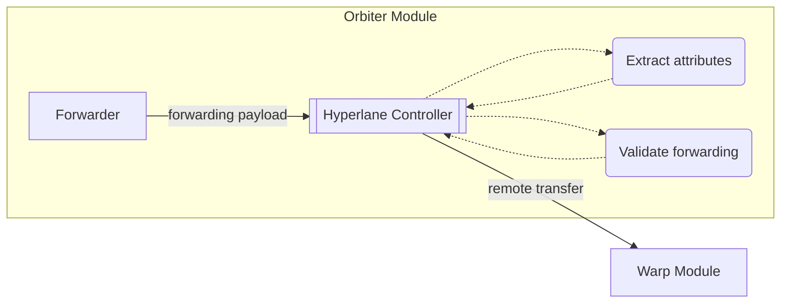

# Controllers

## Forwarding

Forwarding controllers are the software components implementing the `ControllerForwarding` interface
and responsible for handling forwarding packets. A forwarding packet is composed of 2 kinds of
information:

- General information associated with the cross-chain transfer.
- Specific information associated with the protocol that should be used to complete the forwarding
  step.

The forwarding step is completely defined by the core `Forwarding` type, which allows a user to
specify:

1. The cross-chain protocol to use for the forwarding.
2. The cross-chain protocol specific information.
3. Passthrough metadata that has to be attached to the cross-chain transfer.

Forwarding controllers are elements of the Orbiter module used to interpret the protocol-specific
information and use them to forward funds. This specific information is contained in a type
implementing the `ForwardingAttributes` interface. For additional details on the implementation,
please refer to the
[proto definition](https://github.com/noble-assets/orbiter/blob/ad5061a010ae61a5e62699e5bf35e7016f198765/proto/noble/orbiter/core/v1/orbiter.proto#L35-L55)

Controllers enable users to perform:

- AutoCCTP
- AutoLane
- AutoIBC

### Hyperlane

The Hyperlane protocol is a mailbox-based implementation of a permissionless bridge. Mailboxes are
the entrypoints used to send and receive messages via Hyperlane. The cross-chain transfer
functionality is built around the general message passing functionality, Hyperlane **Core**, as an
application called **Warp**. The general architecture is similar to how IBC core and ICS20 are
structured. When we send coins, we first call into the Warp server which then calls into the Core,
and when we receive them, the flow is in the opposite direction. Two elements are important to be
aware of:

- Interchain Security Modules (ISMs): these modules are used to verify a received message.
- Post dispatch hooks: these modules are used to execute post dispatch logic when a message is sent.

For additional information, please refer to the [Hyperlane docs](https://docs.hyperlane.xyz/).

The Hyperlane controller is the specific implementation of the controller interface designed to
handle Hyperlane transfers. A Hyperlane transfer is defined by the
[`HypAttributes`](https://github.com/noble-assets/orbiter/blob/ad5061a010ae61a5e62699e5bf35e7016f198765/proto/noble/orbiter/controller/forwarding/v1/hyperlane.proto#L12-L48)
type, which is one of the concrete implementations of the forwarding attributes interface:

```proto
type HypAttributes struct {
 TokenId []byte `protobuf:"bytes,1,opt,name=token_id,json=tokenId,proto3" json:"token_id,omitempty"`
 DestinationDomain uint32 `protobuf:"varint,2,opt,name=destination_domain,json=destinationDomain,proto3" json:"destination_domain,omitempty"`
 Recipient []byte `protobuf:"bytes,3,opt,name=recipient,proto3" json:"recipient,omitempty"`
 CustomHookId []byte `protobuf:"bytes,4,opt,name=custom_hook_id,json=customHookId,proto3" json:"custom_hook_id,omitempty"`
 GasLimit cosmossdk_io_math.Int `protobuf:"bytes,5,opt,name=gas_limit,json=gasLimit,proto3,customtype=cosmossdk.io/math.Int" json:"gas_limit"`
 MaxFee types.Coin `protobuf:"bytes,6,opt,name=max_fee,json=maxFee,proto3,castrepeated=github.com/cosmos/cosmos-sdk/types.Coins" json:"max_fee"`
 CustomHookMetadata string `protobuf:"bytes,7,opt,name=custom_hook_metadata,json=customHookMetadata,proto3" json:"custom_hook_metadata,omitempty"`
}
```

When the controller receives the forwarding packet, the following steps are executed:

- Hyperlane attributes are extracted from the generic core forwarding type.
- Hyperlane and transfer attributes are validated.
- The forwarding is executed.



The validation step consists of basic validation on the types, like checks for nil pointers, and the
check on the specified token ID. This validation uses the Warp application query server to retrieve
the `WrappedHypToken`, and then verifies that the associated origin denom is the same as the
destination denom specified in the transfer attributes. Remember that a denom can be associated with
multiple token IDs, so it is of paramount importance to specify the correct identifier.

For the forwarding to work, the Hyperlane token ID must exist and it has to be enrolled with a
router associated with the destination chain. This router is used to retrieve the contract on the
destination in charge of handling the request. The token ID will also be used as the sender of the
message in the protocol.

The forwarding step is executed by means of the Hyperlane Warp server which is passed to the
controller during its instantiation. By using the server instead of calling directly into the
keeper, we guarantee that all the required checks are performed, and that all the standard events
are emitted by the Warp module.

Besides the straightforward information contained in the Hyperlane attributes, some of them require
a quick explanation to be properly specified. When we dispatch the message, two post dispatch hooks
are called in sequence:

- The required hook associated with the mailbox.
- A default hook associated with the mailbox.

While the first hook is mandatory, the second one can be replaced by a custom hook specified via the
custom hook ID field. The custom hook can be used to handle the other optional field called custom
hook metadata. Notice that the execution of the two post dispatch hooks is limited by the maximum
fee field.
