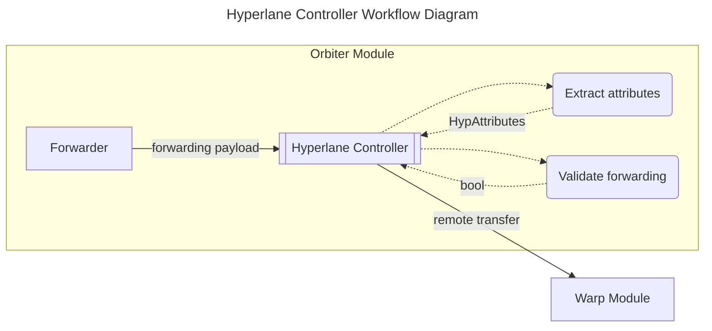

# Controllers

## Introduction

Forwarding controllers are software components that implement the
[`ForwardingController`](https://github.com/noble-assets/orbiter/blob/main/types/controller.go#L30-L33)
interface and handle forwarding packets.

```go
type ControllerForwarding interface {
 Controller[core.ProtocolID]
 PacketHandler[*ForwardingPacket]
}
```

A [`ForwardingPacket`](https://github.com/noble-assets/orbiter/blob/main/types/packet.go#L171-L174)
consists of two parts:

```go
type ForwardingPacket struct {
 TransferAttributes *TransferAttributes
 Forwarding         *core.Forwarding
}
```

- **Transfer attributes**: General information about the cross-chain transfer.
- **Forwarding attributes**: Protocol-specific information for completing the forwarding step.

All controllers are orchestrated by the
[`Forwarder`](https://github.com/noble-assets/orbiter/blob/main/keeper/component/forwarder/forwarder.go#L42-L55).

## Forwarding

The forwarding step is defined by the core
[`Forwarding`](https://github.com/noble-assets/orbiter/blob/main/proto/noble/orbiter/core/v1/orbiter.proto#L35-L55)
type, which allows users to specify:

1. The cross-chain protocol for forwarding
2. Protocol-specific information
3. Passthrough metadata to send along with the to the cross-chain transfer

Protocol-specific information is encoded in the `Attributes` field using an `any`
type that implements the `ForwardingAttributes` interface.
For implementation details, refer to the
[proto definition](https://github.com/noble-assets/orbiter/blob/main/proto/noble/orbiter/core/v1/orbiter.proto#L35-L55).

Forwarding controllers interpret protocol-specific information and forward funds.
Based on the selected bridge, the following controllers are available:

- **AutoCCTP**: Automatic forwarding via the Cross-Chain Transfer Protocol
- **AutoLane**: Automatic forwarding via the Hyperlane protocol
- **AutoIBC**: Automatic forwarding via the Inter-Blockchain Communication (IBC) protocol

## CCTP

The Cross-Chain Transfer Protocol (CCTP) is an interoperability protocol developed by Circle
to enable native USDC transfers across different blockchain networks.
CCTP uses a burn-and-mint mechanism where USDC is burned on the source chain and minted on the destination chain,
ensuring that the total supply remains constant across all supported chains.

For more detailed information about the protocol itself, please refer to the [Circle CCTP documentation](https://developers.circle.com/cctp).

The CCTP controller is the concrete implementation of the controller interface designed to handle CCTP transfers.
All relevant information related to a CCTP transfer is defined by
the [`CCTPAttributes`](https://github.com/noble-assets/orbiter/blob/main/proto/noble/orbiter/controller/forwarding/v1/cctp.proto#L9-L26) type,
which implements the forwarding attributes interface.
The corresponding Protobuf implementation can be seen here:

```protobuf
message CCTPAttributes {
  option (cosmos_proto.implements_interface) = "orbiter.core.v1.ForwardingAttributes";

  uint32 destination_domain = 1;
  bytes mint_recipient = 2;
  bytes destination_caller = 3;
}
```

When the controller receives the forwarding packet, the following steps are executed:

- CCTP attributes are extracted from the generic core forwarding type.
- The general transfer attributes as well as the protocol specific ones are validated.
- The forwarding is executed.


**Validation** includes standard type checks and CCTP-specific validation:

- The destination domain is not the Noble domain
- The mint recipient address is not empty
- The destination caller address is not empty

**Execution** calls the CCTP module's `DepositForBurnWithCaller` message server,
which initiates the burn process on the source chain
and sends the necessary information to the destination chain for minting.

The CCTP protocol uses a commit-and-forget style, meaning that
once the CCTP server confirms that the burn request has been stored to state,
the Orbiter execution is complete.
The events emitted during this state transition are then picked up by the relayers
and forwarded to the destination chain.

## Hyperlane

The Hyperlane protocol is a mailbox-based permissionless bridge
that enables cross-chain transfers through its **Warp** application,
which is built on top of Hyperlane's general message passing functionality.
The architecture follows a pattern similar to IBC core and ICS-20,
where the Warp server handles token transfers by delegating to the underlying Core module.

Key components include:

- **Mailboxes**: Entrypoints for sending and receiving cross-chain messages.
- **Interchain Security Modules (ISMs)**: Verify received messages.
- **Post-dispatch hooks**: Execute additional logic after message transmission.

For additional information, please refer to the [Hyperlane docs](https://docs.hyperlane.xyz/).

The Hyperlane controller handles transfers using the
[`HypAttributes`](https://github.com/noble-assets/orbiter/blob/main/proto/noble/orbiter/controller/forwarding/v1/hyperlane.proto#L12-L48)
type:

```protobuf
message HypAttributes {
  option (cosmos_proto.implements_interface) = "orbiter.core.v1.ForwardingAttributes";

  bytes token_id = 1;
  uint32 destination_domain = 2;
  bytes recipient = 3;
  bytes custom_hook_id = 4;
  string gas_limit = 5 [
    (gogoproto.nullable) = false,
    (amino.dont_omitempty) = true,
    (cosmos_proto.scalar) = "cosmos.Int",
    (gogoproto.customtype) = "cosmossdk.io/math.Int"
  ];
  cosmos.base.v1beta1.Coin max_fee = 6 [
    (gogoproto.nullable) = false,
    (amino.dont_omitempty) = true,
    (amino.encoding) = "legacy_coins",
    (gogoproto.castrepeated) = "github.com/cosmos/cosmos-sdk/types.Coins"
  ];
  string custom_hook_metadata = 7;
}
```

The controller follows the same three-step process as other forwarding controllers:



**Validation** includes standard type checks plus Hyperlane-specific validation:

- Token ID verification using the Warp query server.
- Origin denom matching with the destination denom (crucial since multiple token IDs can map to the same denom).
- Token ID enrollment with a router for the destination chain.

**Execution** uses the Warp message server to initiate the transfer,
ensuring all required checks and standard events are handled.
The transfer triggers two post-dispatch hooks in sequence:

1. The mandatory mailbox hook.
2. Either the default hook or a custom hook (if specified via `custom_hook_id`).

The custom hook can process the optional `custom_hook_metadata`,
and both hooks are subject to the gas limit and maximum fee constraints.
