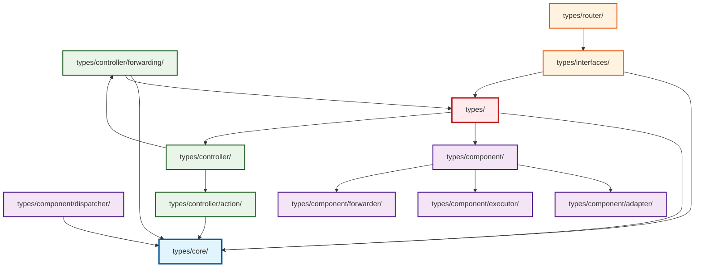

# Types Package Dependencies Graph

This document visualizes the internal dependencies between packages in the `types/` directory of the
Orbiter module.

## Dependency Graph

## Package Descriptions

### Core Package (`types/core/`)

- **Purpose**: Foundational types and structures
- **Files**: `id.go`, `orbiter.go`, `attributes.go`, `keys.go`, `errors.go`
- **Dependencies**: None (foundation layer)
- **Key Types**: Core ID types, Orbiter structures, error definitions

### Component Packages

- **`types/component/`**: Aggregates all component sub-packages
- **`types/component/dispatcher/`**: Handles payload processing and execution
- **`types/component/adapter/`**: Interfaces with external protocols
- **`types/component/executor/`**: Transaction execution logic
- **`types/component/forwarder/`**: Message forwarding functionality

### Controller Packages

- **`types/controller/`**: Aggregates all controller sub-packages
- **`types/controller/action/`**: Pre-execution actions (fee payments)
- **`types/controller/forwarding/`**: Cross-chain forwarding (CCTP implementation)

### Interface and Router Packages

- **`types/interfaces/`**: Interface definitions for all components
- **`types/router/`**: Router implementations for extensibility

### Root Package (`types/`)

- **Purpose**: Main entry point with codec registration
- **Files**: `codec.go`, `genesis.go`, `packet.go`
- **Dependencies**: Imports from component, controller, and core packages

## Dependency Levels

1. **Level 0**: `core/` - Foundation with no internal dependencies
2. **Level 1**: Components and controllers that only depend on core
3. **Level 2**: Packages depending on core + root types
4. **Level 3**: Interface definitions and routing
5. **Level 4**: Package aggregators (component/, controller/)
6. **Level 5**: Root types package (main entry point)

## Key Design Principles

- **No Circular Dependencies**: Clean hierarchical structure
- **Core Foundation**: All packages ultimately depend on `types/core/`
- **Modular Design**: Clear separation between components, controllers, and interfaces
- **Aggregation Pattern**: Parent packages aggregate their sub-packages through codec files

