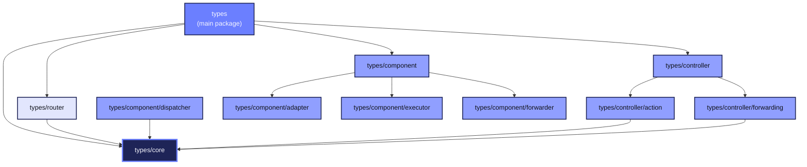

# Dependencies

## Types package

```mermaid
graph TD
      %% Define the style classes using Noble brand colors
      classDef coreClass fill:#1E2457,stroke:#6B7FFF,stroke-width:3px,color:#F6F6FE
      classDef mainClass fill:#6B7FFF,stroke:#1E2457,stroke-width:2px,color:#F6F6FE
      classDef subClass fill:#909FFF,stroke:#1E2457,stroke-width:2px,color:#101219
      classDef routerClass fill:#E2E6FD,stroke:#1E2457,stroke-width:2px,color:#101219

      %% Package nodes
      TYPES["types<br/>(main package)"]
      CORE["types/core"]
      ROUTER["types/router"]
      COMPONENT["types/component"]
      COMP_ADAPT["types/component/adapter"]
      COMP_DISP["types/component/dispatcher"]
      COMP_EXEC["types/component/executor"]
      COMP_FORW["types/component/forwarder"]
      CONTROLLER["types/controller"]
      CTRL_ACTION["types/controller/action"]
      CTRL_FORW["types/controller/forwarding"]

      %% Dependencies
      TYPES --> CORE
      TYPES --> ROUTER
      TYPES --> COMPONENT
      TYPES --> CONTROLLER

      ROUTER --> CORE
      COMPONENT --> COMP_ADAPT
      COMPONENT --> COMP_EXEC
      COMPONENT --> COMP_FORW
      COMP_DISP --> CORE
      CONTROLLER --> CTRL_ACTION
      CONTROLLER --> CTRL_FORW
      CTRL_ACTION --> CORE
      CTRL_FORW --> CORE

      %% Apply styles
      class CORE coreClass
      class TYPES mainClass
      class ROUTER routerClass
      class COMPONENT,COMP_ADAPT,COMP_DISP,COMP_EXEC,COMP_FORW,CONTROLLER,CTRL_ACTION,CTRL_FORW subClass
```
