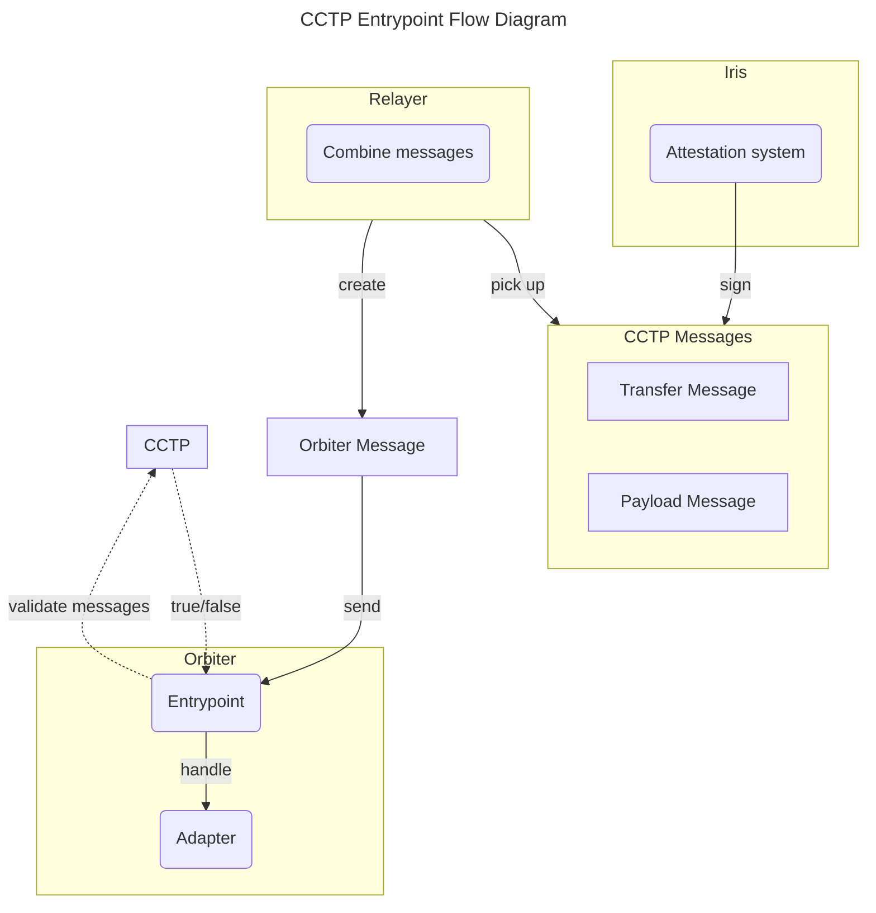

# Entrypoints

## Introduction

The Orbiter module is executed when a cross-chain packet with its module account as destination is
received. Since different bridges solution are available, before executing the Orbiter logic, we
have a reconciliation phase in which we convert the incoming bridge-specific packet, into a common
representation used on Noble.

This conversion phase is performed by a component named adapter, which exposes the methods to
convert a generic cross-chain packet into the desired type. This is the context in which entrypoints
are used. An entrypoint is a piece of the Noble core stack with the purpose of receive the bridge
message, and orchestrate the adapter to convert the specific type into the Orbiter one and to
initiate the Orbiter transition.

## Implementation

### CCTP

Noble implements the CCTP protocol in the [noble-cctp](https://github.com/circlefin/noble-cctp)
module. The entrypoint for the protocol is implemented as a message server that uses the CCTP module
to validate messages, and to execute USDC bridge operations.

