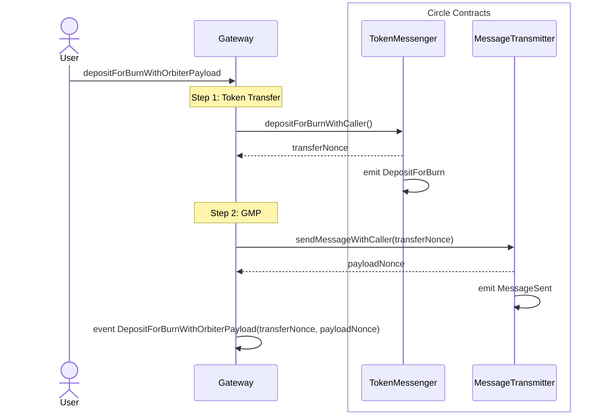

# Gateways

## Introduction

The Orbiter module is based on the 3-steps logic to abstract cross-chain transfers which uses Noble
as an intermediary step. The bridge implementation abstraction, is achieved through an initial
adaptation phase of the cross-chain transfer and payload.

Every bridge solution is designed differently, and specifically, not all solutions allow to perform
a transfer with attached metadata. This feature is of paramount importance because allows to have an
atomic handling of the received funds and payload in a single tx execution. Considering the
supported interoperability solutions, we have:

- IBC: Allows to send a cross-chain transfer along with metadata in the
  [`memo`](https://github.com/cosmos/ibc/blob/main/spec/app/ics-020-fungible-token-transfer/README.md)
  field.
- Hyperlane: Allows to specify a
  [metadata](https://github.com/hyperlane-xyz/hyperlane-monorepo/blob/main/solidity/contracts/token/libs/TokenMessage.sol#L37-L41)
  in a token transfer. However, the Hyperlane protocol is a specific bridge implementation design
  for smart contracts, and this property is directly coupled with the token smart contract
  implementation used. This result in a not easy way to handle the token metadata on the Cosmos SDK
  world where tokens are not programmable contracts.
- CCTP V1: Noble support the first version of the CCTP protocol, which does not allow to have a
  single cross-chain message with both token transfer and metadata attached.

Gateways are specific smart contract implementations design to facilitate the usage of Hyperlane and
CCTP for cross-chain transfer using the Orbiter:

- Hyperlane Gateway: This gateway allows to create an Hyperlane transfer of a HypER20 extension with
  Orbiter metadata support to a custom Warp application on Noble.

- CCTP Gateway: This gateway allows to initiate a CCTP token transfer coupled with a general message
  passing (GMP) transfer containing the Orbiter payload.

## Transfer via Gateway

Describe how the transfer is done via Gateways (hash, single signature from user) ...

Desired properties of a transfer:

- Single signature from the user.

- Protect the transfer for information tempering.

- Token transfer and payload execution part of a single state transition.

### Payload Hash

Explain why we use the hash of the payload...

## CCTP

The CCTP V1 implementation provides a general message passing protocol, and a specific application
built around it to facilitate token transfers. Since there is no way to add metadatada to the token
transfer message, we are forced to send two separate messages, one for the token transfer, and one
for the Orbiter payload.

The gateway contract is used to initiate a transfer:

- Allowing the user to sign a single transaction on the source chain.

- Linking the token transfer to the GMP containing the payload.

