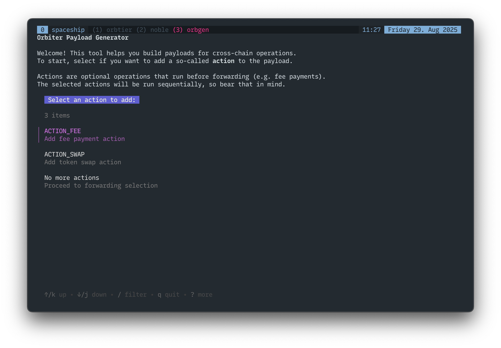

# Integration

## Introduction

This document describes how to integrate with the Orbiter module to leverage Noble cross-chain
functionalities.

The Orbiter module is a payload-based module, which is capable of parsing cross-chain metadata from
different sources, executing state transitions, and then forwarding funds to a destination
counterparty. To leverage the Orbiter functionalities, integrators only have to send funds to the
Orbiter account with the requested metadata and via the correct entrypoint. Refer to the
[architecture docs](./architecture.md) for more details.

> [!TIP] Optional information to help a user be more successful.

> [!IMPORTANT] The recipient of the cross-chain transfer MUST be the orbiter module address:

> | Mainnet                                                                                                                            | Testnet                                                                                                                                    |
> | ---------------------------------------------------------------------------------------------------------------------------------- | ------------------------------------------------------------------------------------------------------------------------------------------ |
> | [noble15xt7kx5mles58vkkfxvf0lq78sw04jajvfgd4d](https://www.mintscan.io/noble/address/noble15xt7kx5mles58vkkfxvf0lq78sw04jajvfgd4d) | [noble15xt7kx5mles58vkkfxvf0lq78sw04jajvfgd4d](https://www.mintscan.io/noble-testnet/address/noble15xt7kx5mles58vkkfxvf0lq78sw04jajvfgd4d) |

## Payload Creation

This section describes how to create a corresponding Orbiter payload. Based on the bridge protocol
used to initiate the transfer, a specific payload must be provided. This is associated with the
entrypoint for the particular protocol. For example, IBC allows to pass metadata along with a
cross-chain transfer via the _memo_, which is a JSON-formatted string. Other protocols, like CCTP,
require the payload to be in the bytes format. Refer to the [payload docs](./payload.md) for more
details about the payload fields and the supported actions and forwardings.

### IBC Payload

#### CLI

For ease of use, we have provided a terminal utility that you can check out at
[noble-assets/orbgen](https://github.com/noble-assets/orbgen/).



Orbgen allows you to create the required payload to pass along with the cross-chain transfer through
a simple TUI. Just follow the steps, provide the required information, and the payload will be
printed on your terminal.

#### Manual Process

This section describes how to create a valid IBC payload in Golang:

1. Import the required packages from the Orbiter repo:

   ```go
   import(
     "github.com/noble-assets/orbiter/types/core"
     "github.com/noble-assets/orbiter/types"
     "github.com/noble-assets/orbiter/testutil"

     actiontypes "github.com/noble-assets/orbiter/types/controller/action"
     forwardingtypes "github.com/noble-assets/orbiter/types/controller/forwarding"
   )
   ```

2. Create the forwarding via a factory function:

   ```go
   forwarding, err := forwardingtypes.NewCCTPForwarding(
    destinationDomain,
    mintRecipient,
    destinationCaller,
    passthroughPayload,
   )
   ```

3. Define the action and set the attributes:

   ```go
   action, err := actiontypes.NewFeeAction(
    &actiontypes.FeeInfo{
     Recipient:   feeRecipientAddr,
     BasisPoints: basisPoints,
    },
   )
   ```

4. Create a wrapped payload:

   ```go
    payload, err := core.NewPayloadWrapper(orbit, action)
   ```

5. Marshal the payload structure into JSON using the codec with registered interfaces:

   ```go
    encCfg := testutil.MakeTestEncodingConfig("noble")
    orbiter.RegisterInterfaces(encCfg.InterfaceRegistry)
    payloadBz, err := types.MarshalJSON(encCfg.Codec, payload)
    payloadStr := string(payloadBz)
   ```

6. The payload is now ready to be added in the ICS20 memo field.

A concrete example for the payload creation can be found in the file
[`e2e/ibc_to_cctp_test.go`](../e2e/ibc_to_cctp_test.go).

### Important Notes

- The Noble chain commits to executing the outgoing transfer using the protocol specified in the
  `forwarding` field as part of the same transaction that processes the incoming request.
